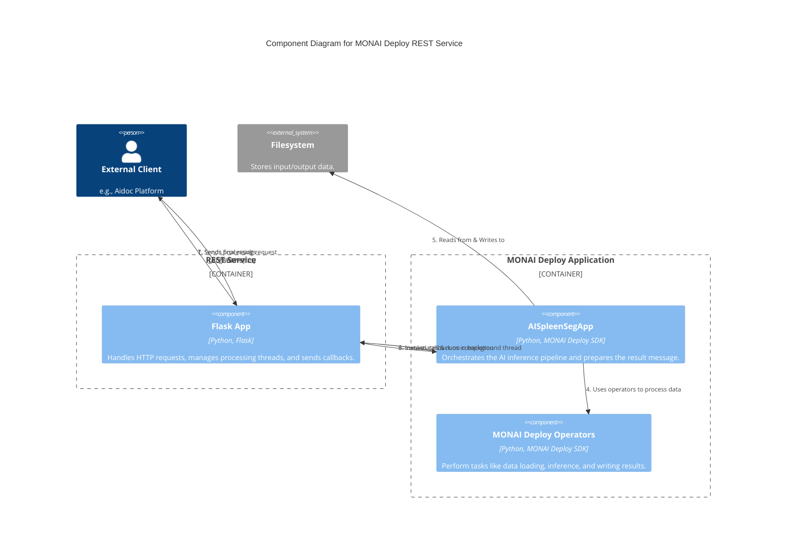
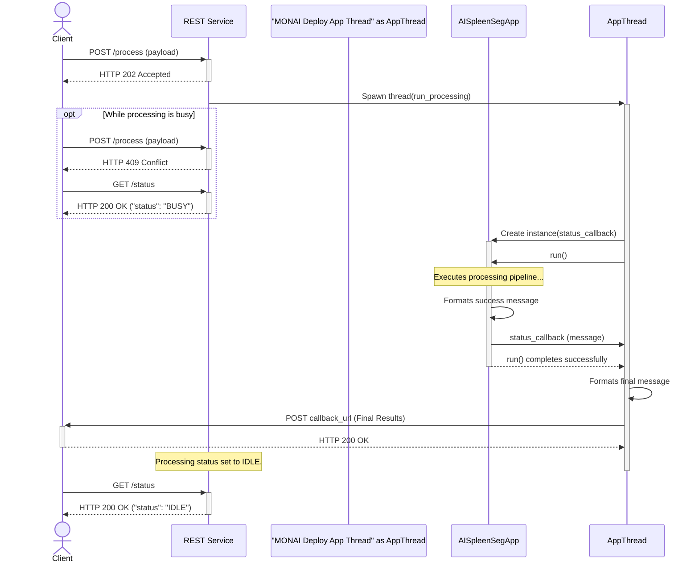

# Creating REST Service with MONAI Deploy Application

This application provides an example of how to make a MONAI Deploy app run as a REST service on [Aidoc](https://www.aidoc.com/) platform. It is compliant with its [third party integration API](https://ai-partner-sdk.aidoc-cloud.com/prod/api/third-parties/doc/#), and the results [callback message schema](https://ai-partner-sdk.aidoc-cloud.com/prod/api/aidoc-callback/doc/#).

This example uses a subset of the callback message attributes, covering only the required ones as well as some common attributes. For the full message definition, please contact Aidoc directly.

## High Level Design

The high-level design of this REST service involves a few key components:

1.  **MONAI Deploy Application**: The core AI logic is encapsulated in a standard MONAI Deploy application (e.g., `AISpleenSegApp`), which is built and tested as a regular containerized workload.
2.  **REST Service**: A lightweight REST application, built using Flask, acts as the front-end. It exposes endpoints to start and check the status of a processing job.
3.  **Request Handling**:
    -   When the REST service receives a request to process data, it handles only one request at a time, as per the API specification.
    -   It creates an instance of the MONAI Deploy application.
    -   It sets the necessary environment variables for the input and output folders.
    -   Crucially, it delegates the execution of the MONAI Deploy application to a separate background thread to avoid blocking the web server.
4.  **Callback Mechanism**:
    -   The callback message, which includes the AI results and a list of output files, is generated within the MONAI Deploy application at the end of its run.
    -   This message is then passed to a callback function that was provided by the REST service during the creation of the MONAI Deploy app instance.
    -   The REST service, upon receiving the callback, is then responsible for making the final `POST` request to the external callback endpoint specified by the original caller.

This design separates the core AI application from the web-serving logic, allowing each to be developed and tested independently.

## Diagrams

### Component Diagram

This diagram shows the static components of the system and their relationships using the C4 model.



### Sequence Diagram

This diagram illustrates the sequence of interactions for a processing job, including status checks.



## How to Run

Change working directory to the same level as this README.

1.  **Install Dependencies**

    Create and activate a Python virtual environment.

    ```bash
    pip install -r restful_app/requirements.txt
    ```
2.  **Download Test Data and Set Env Vars**
    The model and test DICOM series are shared on Google Drive requiring first gaining access permission, and
    the zip file is [here](https://drive.google.com/uc?id=1IwWMpbo2fd38fKIqeIdL8SKTGvkn31tK).

    Please make a request so that it can be shared to specific Gmail account.

    `gdown` may also work.
    ```
    pip install gdown
    gdown https://drive.google.com/uc?id=1IwWMpbo2fd38fKIqeIdL8SKTGvkn31tK
    ```

    Unzip the file to local folders. If deviating from the path noted below, please adjust the env var values

    ```
    unzip -o "ai_spleen_seg_bundle_data.zip"
    rm -rf models && mkdir -p models/model && mv model.ts models/model && ls models/model
    ```

    Set the environment vars so that the model can be found by the Spleen Seg app. Also,
    the settings are consolidated in the `env_settings.sh`.

    ```
    export HOLOSCAN_MODEL_PATH=models
    ```

3.  **Run the Web Application**

    ```bash
    python restful_app/app.py
    ```

    The application will start on `http://127.0.0.1:5000`.

## Test API Endpoints

A simplest test client is provided, which makes call to the endpoint, as well as providing
a callback endpoint to receives message content at the specified port.

Open another console window and change directory to the same as this file.

Set the environment vars so that the test script can get the input DCM and write the callback contents.
Also, once the REST app completes each processing, the Spleen Seg app's output will also be saved in
the output folder specified below (the script passes the output folder via the Rest API).

```
export HOLOSCAN_INPUT_PATH=dcm
export HOLOSCAN_OUTPUT_PATH=output
```

Run the test script, and examine its console output.

```
source test_endpoints.sh
```

Once the script completes, examine the `output` folder, which should contain the following (dcm file
name will be different)

```
output
├── 1.2.826.0.1.3680043.10.511.3.22611096892439837402906545708809852.dcm
└── stl
    └── spleen.stl
```

The script can run multiple times, or modified to loop with different output folder setting.

### Check Status

-   **URL**: `/status`
-   **Method**: `GET`
-   **Description**: Checks the current status of the processor.
-   **Success Response**:
    -   **Code**: 200 OK
    -   **Content**: `{ "status": "IDLE" }` or `{ "status": "BUSY" }`

### Process Data

-   **URL**: `/process`
-   **Method**: `POST`
-   **Description**: Starts a new processing job.
-   **Body**:

    ```json
    {
        "input_folder": "/path/to/your/input/data",
        "output_folder": "/path/to/your/output/folder",
        "callback_url": "http://your-service.com/callback"
    }
    ```

-   **Success Response**:
    -   **Code**: 202 ACCEPTED
    -   **Content**: `{ "message": "Processing started." }`
-   **Error Response**:
    -   **Code**: 409 CONFLICT
    -   **Content**: `{ "error": "Processor is busy." }`
    -   **Code**: 400 BAD REQUEST
    -   **Content**: `{ "error": "Missing required fields." }`

### Callback

When processing is complete, the application will send a `POST` request to the `callback_url` provided in the process request. The body of the callback will be:

```json
{
    "run_success": true,
    "output_files": ["output_spleen/1.2.826.0.1.3680043.10.511.3.13787585732573161684951883631909444.dcm", "output_spleen/stl/spleen.stl"],
    "error_message": null,
    "error_code": null,
    "result": {
        "aggregated_results": {
            "name": "Spleen Segmentation",
            "algorithm_class": ["Measurement"]
        },
        "detailed_results":{
            "Spleen Segmentation": {
                "detection": null,
                "measurement": {
                    "measurements_text": "Spleen segmentation completed successfully.", "key_slice_instance_uid": null,
                    "key_measurement": null
                },
                "classification": null
            }
        }
    }
}
```

Or in case of an error:

```json
{
    "run_success": false,
    "error_message": "E.g., Model network is not load and model file not found.",
    "error_code": 500
}
```
