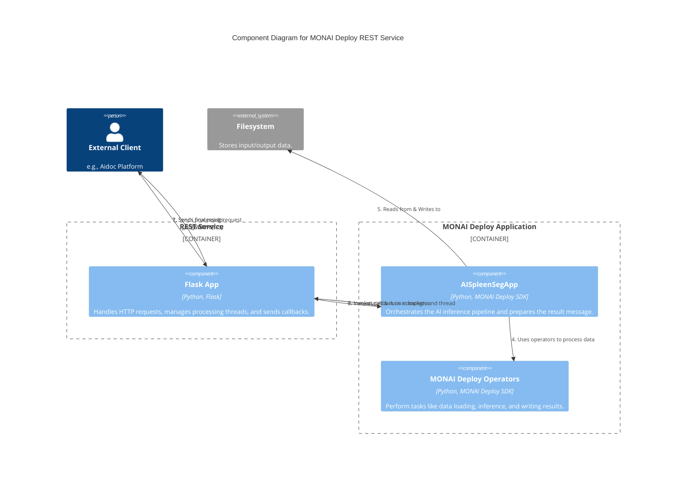
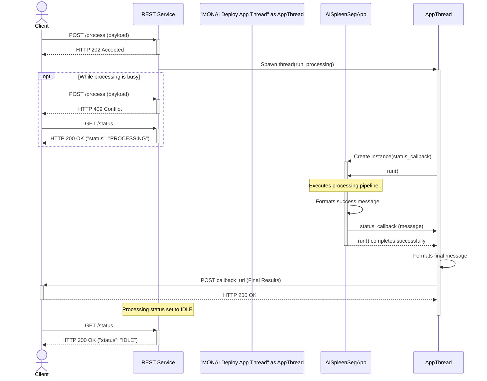

# Creating REST Service with MONAI Deploy Application

This application provides an example of how to make a MONAI Deploy app run as a REST service on the [Aidoc](https://www.aidoc.com/) platform. It is compliant with its [third party integration API](https://ai-partner-sdk.aidoc-cloud.com/prod/api/third-parties/doc/#), and the results [callback message schema](https://ai-partner-sdk.aidoc-cloud.com/prod/api/aidoc-callback/doc/#).

This example uses a subset of the callback message attributes, covering only the required ones as well as some common attributes. For the full message definition, please contact Aidoc directly.

## High Level Design

The high-level design of this REST service involves a few key components:

1.  **MONAI Deploy Application**: The core AI logic is encapsulated in a standard MONAI Deploy application (e.g., `AISpleenSegApp`), which is built and tested as a regular containerized workload. The application is responsible for generating the inference results using Pydantic classes that are based on Aidoc's callback message schema. It then reports these results as a JSON string via a callback function provided during its construction.
2.  **REST Service**: A lightweight REST application, built using Flask, acts as the front-end. It exposes endpoints to start and check the status of a processing job.
3.  **Request Handling**:
    -   When the REST service receives a request to process data, it handles only one request at a time, as per the API specification.
    -   It creates an instance of the MONAI Deploy application.
    -   It sets the necessary environment variables for the input and output folders for the processing execution.
    -   Crucially, it delegates the execution of the MONAI Deploy application to a separate background thread to avoid blocking the web server.
4.  **Callback Mechanism**:
    -   The callback message, which includes the AI results and a list of output files, is generated within the MONAI Deploy application at the end of its run.
    -   This message is then passed to a callback function that was provided by the REST service during the creation of the MONAI Deploy app instance.
    -   The REST service, upon receiving the callback, is then responsible for making the final `POST` request to the external callback endpoint specified by the original caller.

This design separates the core AI application from the web-serving logic, allowing each to be developed and tested independently.

### Component Diagram

This diagram shows the static components of the system and their relationships.



### Sequence Diagram

This diagram illustrates the sequence of interactions for a processing job, including status checks.



## How to Run in Development Environment

Change your working directory to the one containing this README file and the `restful_app` folder.

1.  **Install Dependencies**

    Create and activate a Python virtual environment.

    ```bash
    pip install -r restful_app/requirements.txt
    ```
2.  **Download Test Data and Set Environment Variables**
    The model and test DICOM series are shared on Google Drive, which requires gaining access permission first. The zip file is available [here](https://drive.google.com/uc?id=1IwWMpbo2fd38fKIqeIdL8SKTGvkn31tK).

    Please make a request so that it can be shared with a specific Gmail account.

    `gdown` may also work:
    ```
    pip install gdown
    gdown https://drive.google.com/uc?id=1IwWMpbo2fd38fKIqeIdL8SKTGvkn31tK
    ```

    Unzip the file to local folders. If deviating from the path noted below, please adjust the env var values.

    ```
    unzip -o "ai_spleen_seg_bundle_data.zip"
    rm -rf models && mkdir -p models/model && mv model.ts models/model && ls models/model
    ```

    Set the environment variables so that the model can be found by the Spleen Seg app. These settings are also consolidated in the `env_settings.sh` script.

    ```
    export HOLOSCAN_MODEL_PATH=models
    ```

3.  **Run the Web Application**

    ```bash
    python restful_app/app.py
    ```

    The application will start on `http://127.0.0.1:5000`.

## Test API Endpoints

A simple test client is provided, which makes calls to the endpoint, as well as providing a callback endpoint to receive message content at the specified port.

Open another console window and change directory to the same as this file.

Set the environment vars so that the test script can get the input DCM and write the callback contents. Also, once the REST app completes each processing, the Spleen Seg app's output will also be saved in the output folder specified below (the script passes the output folder via the REST API).

```
export HOLOSCAN_INPUT_PATH=dcm
export HOLOSCAN_OUTPUT_PATH=output_restful_app
```

Run the test script, and examine its console output.

```
source test_endpoints.sh
```

Once the script completes, examine the `output` folder, which should contain the following (the DICOM file name will be different):

```
output
├── 1.2.826.0.1.3680043.10.511.3.22611096892439837402906545708809852.dcm
└── stl
    └── spleen.stl
```

The script can be run multiple times or modified to loop with different output folder settings.

### Check Status

-   **URL**: `/status`
-   **Method**: `GET`
-   **Description**: Checks the current status of the processor.
-   **Success Response**:
    -   **Code**: 200 OK
    -   **Content**: `{ "status": "IDLE" }` or `{ "status": "PROCESSING" }`

### Process Data

-   **URL**: `/process`
-   **Method**: `POST`
-   **Description**: Starts a new processing job.
-   **Body**:

    ```json
    {
        "input_folder": "/path/to/your/input/data",
        "output_folder": "/path/to/your/output/folder",
        "callback_url": "http://your-service.com/callback"
    }
    ```

-   **Success Response**:
    -   **Code**: 202 ACCEPTED
    -   **Content**: `{ "message": "Processing started." }`
-   **Error Response**:
    -   **Code**: 409 CONFLICT
    -   **Content**: `{ "error": "Processor is busy." }`
    -   **Code**: 400 BAD REQUEST
    -   **Content**: `{ "error": "Missing required fields." }`

### Callback

When processing is complete, the application will send a `POST` request to the `callback_url` provided in the process request. The body of the callback will be similar to this:

```json
{
    "run_success": true,
    "output_files": ["output_spleen/1.2.826.0.1.3680043.10.511.3.13787585732573161684951883631909444.dcm", "output_spleen/stl/spleen.stl"],
    "error_message": null,
    "error_code": null,
    "result": {
        "aggregated_results": {
            "name": "Spleen Segmentation",
            "algorithm_class": ["Measurement"]
        },
        "detailed_results":{
            "Spleen Segmentation": {
                "detection": null,
                "measurement": {
                    "measurements_text": "Spleen segmentation completed successfully.", "key_slice_instance_uid": null,
                    "key_measurement": null
                },
                "classification": null
            }
        }
    }
}
```

Or in case of an error:

```json
{
    "run_success": false,
    "error_message": "E.g., Model network is not load and model file not found.",
    "error_code": 500
}
```

Please note: The test script uses a simple `nc` command to emulate the callback service. This lightweight approach may sometimes lead to timeout errors on the client side (the REST service), preventing the test script from capturing the callback message. If this occurs, running the script again is a known workaround.

## Packaging and Testing the REST Service Container

### Packaging the Application

To package the REST service application into a MONAI App Package (MAP) container, you can use the MONAI Deploy CLI. The following is an example command, run with the current working directory as the parent of `restful_app`:

```bash
monai-deploy package restful_app -m models/spleen_ct -c restful_app/app.yaml -t monai-rest:1.0 --platform x86_64 -l DEBUG
```

This command packages the `restful_app` directory, includes the specified model, uses `app.yaml` for configuration, and tags the resulting Docker image as `monai-rest-x64-workstation-dgpu-linux-amd64:1.0`, which includes the target platform name.

Note that the model folder should contain only the model file (e.g., `model.ts`) or subfolders that each contain only a model file.


### Running the MAP Container

While you can run MAPs with the `monai-deploy run` command, it currently has limitations regarding the mapping of arbitrary volumes and passing extra environment variables that are necessary for this REST service. Therefore, it's required to use the `docker run` command directly (or a platform specific equivalent) to have full control over the container's execution environment.

```bash
docker run --gpus=all --network host --name my_monai_rest_service -t --rm \
-v <host folder for staging input folder>:/var/holoscan/input/ \
-v <host folder for saving output folder>:/var/holoscan/output/ \
-v <host folder for saving temp files>:/var/holoscan/ \
-e FLASK_HOST="0.0.0.0" \
-e FLASK_PORT="5000" \
--entrypoint /bin/bash monai-rest-x64-workstation-dgpu-linux-amd64:1.0 -c "python3 -u /opt/holoscan/app/"
```

**Command parameters**

-   `--gpus=all`: Exposes all available host GPUs to the container, which is necessary for CUDA-based inference. A specific CUDA device ID can also be used.
-   `--network host`: The container shares the host's network stack, making the Flask server directly accessible on the host's IP address and port (e.g., `http://localhost:5000`).
-   `--name my_monai_rest_service`: Assigns a convenient name to the running container.
-   `-t --rm`: Allocates a pseudo-terminal and automatically removes the container when it stops.
-   `-v <host folder for staging input folder>:/var/holoscan/input/`: Mounts a host directory into the container as `/var/holoscan/input/`. This allows the REST service to access input files using an internal container path. For example, the inference input (e.g., a DICOM study's instance files) should be staged in a subfolder on the host, e.g. `my_test_study`, and the client request message must use the corresponding internal container path (e.g., `/var/holoscan/input/my_test_study`).
-   `-v <host folder for saving output folder>:/var/holoscan/output/`: Mounts a host directory into the container as `/var/holoscan/output/`, allowing the REST service to save the inference result files.
-   `-e FLASK_HOST="0.0.0.0"` and `-e FLASK_PORT="5000"`: These environment variables configure the Flask-based REST application to be accessible from outside the container on the specified port.
-   `--entrypoint /bin/bash ... -c "python3 -u /opt/holoscan/app/"`: This overrides the default entrypoint of the MAP container. Instead of running the MONAI Deploy application directly, it starts a bash shell that executes the command to run the Flask application, effectively starting the REST service.

The simple test client, `test_endpoints.sh`, can be used to test the REST service container. It requires a couple of simple changes to use the container's internal folder paths for I/O. For example:

```bash
# Get the absolute path to the input and output directories
INPUT_DIR="/var/holoscan/input/spleen_ct_tcia"
OUTPUT_DIR="/var/holoscan/output/output_spleen_rest"
```