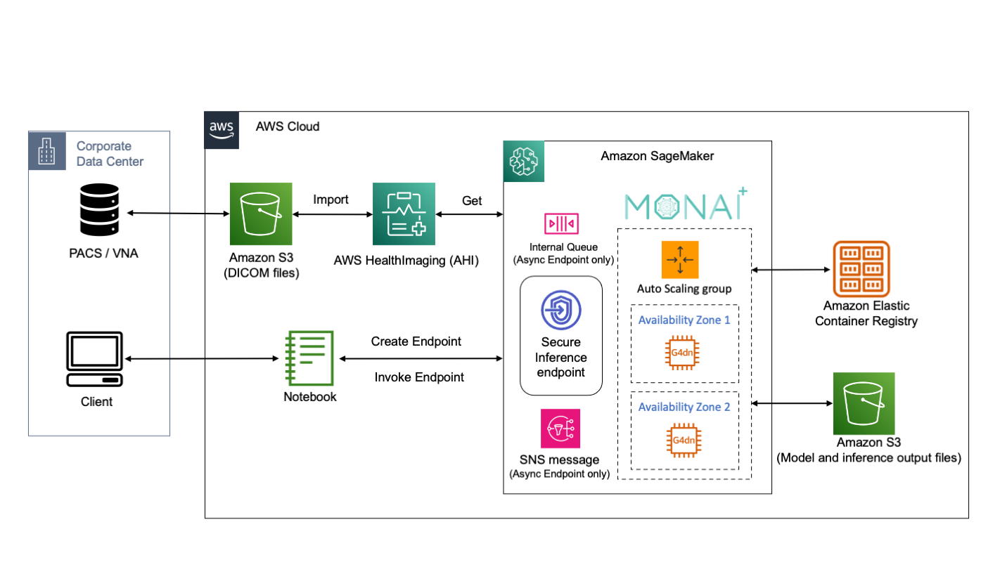

[AWS HealthImaging](https://aws.amazon.com/healthimaging/) (AHI) is a HIPAA-eligible, highly scalable, performant, and cost effective medical imagery store. 

We have developed a [MONAI Deploy connector](https://github.com/aws-samples/healthlake-imaging-to-dicom-python-module/tree/main) to AWS HealthImaging to integrate medical imaging AI applications with sub-second image retrieval latencies at scale powered by cloud-native APIs. 

The MONAI AI models and applications can be hosted on [Amazon SageMaker](https://aws.amazon.com/sagemaker/), which is a fully managed service to deploy Machine Learning (ML) models at scale. Amazon SageMaker takes care of setting up and managing instances for inference and provides built-in metrics and logs for endpoints that you can use to monitor and receive alerts. It also offers a variety of NVIDIA GPU instances for ML inference, as well as multiple model deployment options with automatic scaling, including real-time inference, serverless inference, asynchronous inference and batch transform.

The sample Jupyter notebooks in [this workshop](https://github.com/aws-samples/monai-on-aws-workshop) will walk you through how to deploy [MONAI Application Package (MAP)](https://github.com/Project-MONAI/monai-deploy/blob/main/guidelines/monai-application-package.md) on Amazon Sagemaker, which leverage the MONAI Deploy connector to retrieve image data from AHI and make AI prediction, as showned in this architecture diagram:

