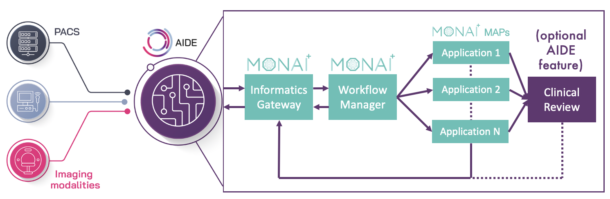

# AIDE
AIDE is an intelligent tool that allows healthcare providers to deploy AI models safely, effectively, and efficiently by enabling the integration of AI models into clinical workflows.

One of the unique features of AIDE is that it was designed by the community, for the community, and will be released as open-source. AIDE is a comprehensive system, encompassing administrative and clinical tasks as well as regulatory compliance.

AIDE provides opportunities for data scientists to deploy applications in hospital settings and in September 2021 the first instance of AIDE went live at King's College Hospital NHS Foundation Trust, with a stroke AI tool to support NHS clinicians to help improve direct patient care.

AIDE 1.0, available on December 2022, is the first release built on MONAI Deploy.

## How it works
AIDE connects any AI product to the entire patient record without requiring additional hardware or installation each time a new product is delivered into the clinical workflow.

Deploying AI often involves installing separate hardware and bespoke connectivity for each algorithm. In comparison, AIDE provides a harmonised hardware and software layer, that facilitates the deployment and use of any AI product.

Once clinical data has been analysed by an AI, the results are sent to the electronic patient record to support clinical decision making, such as prioritising reporting or diagnosis

The platform can receive a live stream of clinical data, allowing clinicians to access near real-time AI analysis within seconds.

MONAI Deploy Informatics Gateway provides the DICOM, FHIR and HL7 I/O, and MONAI Deploy Workflow Manager provides the AI orchestration, identifying the next best task to execute based on the incoming patient study.

## How AIDE adds value
AIDE’s dedicated IT infrastructure allows multiple algorithms to run simultaneously through bespoke Application Programming Interfaces (APIs). This provides NHS Trusts with the capability to run multiple AI solutions for day-to-day clinical care.

AIDE lowers the barrier to deploying clinical AI allowing individual Trusts to speed up the AI transformation of patient pathways.

By September 2023, we aim to deploy AIDE across all 10 NHS Trust partners and provide access to candidate AI applications.
